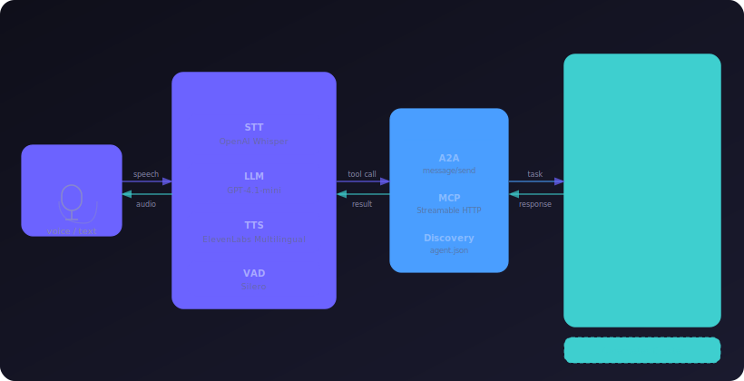
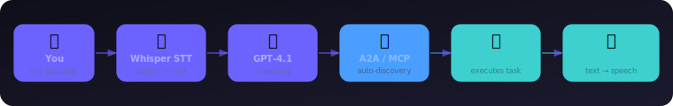

<p align="center">
  
</p>

<h1 align="center">Voiceover: Voice Interface for Any AI Agent</h1>

<p align="center">
  
</p>

>  **Voiceover** is an open-source voice interface for any AI agent.

>Running AI agents in Kubernetes is becoming mainstream. Tools like
  [kagent](https://kagent.dev/)  let you deploy specialized agents for Kubernetes operations, 
  Helm, Istio, Cilium, observability — each with deep domain
  expertise. But interacting with them still means typing commands    
  into a terminal or a chat UI. 

>What if you could just talk?                                        
  
                                                                      
> The core idea is simple: your voice goes in, the agent does the work, the answer comes back as speech - just a conversation with your infrastructure.                       
                                                 

[▶️ Watch a quick demo](https://youtube.com/shorts/3cU2NpGXqRk)

---

## What's New

Key changes compared to the first version of VoiceOps agent:

| Area | Change |
|---|---|
| **Agent framework** | Switched to [Google ADK](https://google.github.io/adk-docs/) compatible A2A — agents are now first-class citizens alongside MCP servers |
| **Transport** | Migrated from legacy SSE to [Streamable HTTP](https://modelcontextprotocol.io/docs/concepts/transports) (MCP spec 2025-03-26) |
| **Auth** | Simplified to Bearer token only — removed HMAC-SHA256 workaround |
| **MCP Sampling** | Added `sampling/createMessage` callback — MCP servers can request inference from the agent's model |
| **Voice / Text** | Console UI supports both modes — toggle with `Ctrl+B` |
| **Code** | Restructured layout, dead code removed, test coverage added |

---

## How It Works

Voiceover bridges your voice to agents via the [A2A (Agent-to-Agent)](https://google.github.io/A2A/) and [MCP (Model Context Protocol)](https://modelcontextprotocol.io/) protocols. Skills and tools are discovered automatically — just configure a URL and talk.

<p align="center">
  
</p>

---

## Quick Start

### Prerequisites

- Python 3.9+
- API keys: ElevenLabs, LiveKit
- LLM backend API key (see [LLM Backends](#llm-backends))

### Install

```sh
make venv
source venv/bin/activate
make install
```

### Configure

```sh
export ELEVEN_API_KEY=your_elevenlabs_api_key
```

Select an LLM backend via `AGENT_LLM_BACKEND` (default: `openai`):

```sh
# OpenAI (default)
export AGENT_LLM_BACKEND=openai
export OPENAI_API_KEY=your_openai_api_key

# Google Gemini
export AGENT_LLM_BACKEND=google
export GOOGLE_API_KEY=your_google_api_key

# Google Vertex AI (requires: gcloud auth application-default login)
export AGENT_LLM_BACKEND=vertex
export GOOGLE_CLOUD_PROJECT=your_project_id

# Ollama
export AGENT_LLM_BACKEND=ollama
```

Override the model with `AGENT_LLM_MODEL` (e.g. `gemini-2.5-pro`, `gpt-4o`).

Edit `config.yaml` to point at your agents or MCP servers (see [Configuration](#configuration)).

### Run

```sh
make run
```

The console UI supports both voice and text input:

- **`Ctrl+B`** — toggle between Audio and Text mode
- **`Q`** — quit

---

## Configuration

### A2A Agents

Connect to any agent that implements the [A2A protocol](https://google.github.io/A2A/). Skills are discovered automatically via `/.well-known/agent.json`.

```yaml
servers:
  - name: k8s-agent
    type: a2a
    url: https://kagent.example.com/api/a2a/kagent/k8s-agent
    auth:                   # optional
      type: bearer
      env_var: KAGENT_TOKEN
```

### MCP Servers

Connect to any [MCP](https://modelcontextprotocol.io/)-compatible tool server over Streamable HTTP.

```yaml
servers:
  - name: my-mcp-server
    type: mcp               # default if omitted
    url: https://my-server.example.com/mcp
    allowed_tools: [tool1, tool2]   # optional — omit to load all
    auth:
      type: bearer
      env_var: MCP_TOKEN
```

### MCP Sampling

Voiceover supports [MCP sampling](https://modelcontextprotocol.io/docs/concepts/sampling) — MCP servers can request LLM inference from the client during tool execution. This allows agentic MCP servers to ask the agent's model for reasoning or decision-making mid-task, without needing their own LLM.

The sampling callback is wired automatically — no extra configuration needed. Any MCP server that sends a `sampling/createMessage` request will receive a response from the configured model.

### Authentication

```yaml
auth:
  type: bearer        # sets Authorization: Bearer <token>
  env_var: MY_TOKEN
```

---

## Example: Kagent Integration

[kagent](https://kagent.dev/) is an open-source framework for running AI agents in Kubernetes. Voiceover connects to kagent agents as A2A servers, giving you a voice interface to your entire cluster.

### 1. Expose the kagent A2A API

```yaml
apiVersion: gateway.networking.k8s.io/v1
kind: HTTPRoute
metadata:
  name: kagent-a2a-route
  namespace: kagent
spec:
  hostnames:
  - kagent.example.com
  parentRefs:
  - kind: Gateway
    name: your-gateway
    namespace: your-gateway-namespace
    sectionName: https
  rules:
  - matches:
    - path:
        type: PathPrefix
        value: /api/a2a
    backendRefs:
    - name: kagent-controller
      port: 8083
```

### 2. Add a2aConfig to your agents

```yaml
apiVersion: kagent.dev/v1alpha2
kind: Agent
metadata:
  name: k8s-agent
  namespace: kagent
spec:
  declarative:
    a2aConfig:
      skills:
      - id: k8s-operations-skill
        name: Kubernetes Operations
        description: Kubernetes cluster operations, troubleshooting, and maintenance.
        inputModes: [text]
        outputModes: [text]
        tags: [k8s, kubernetes]
        examples:
        - "Get all pods in the default namespace"
        - "Describe deployment nginx"
```

### 3. Configure config.yaml

```yaml
servers:
  - name: k8s-agent
    type: a2a
    url: https://kagent.example.com/api/a2a/kagent/k8s-agent

  - name: helm-agent
    type: a2a
    url: https://kagent.example.com/api/a2a/kagent/helm-agent

  - name: observability-agent
    type: a2a
    url: https://kagent.example.com/api/a2a/kagent/observability-agent
```

kagent ships with agents for Kubernetes, Helm, Istio, Cilium, Argo Rollouts, Prometheus/Grafana, and more. See the [kagent docs](https://kagent.dev/docs/) for the full list.

---

## Project Structure

```
voiceover/
├── src/
│   ├── main.py               # Entry point
│   ├── agent_core.py         # LiveKit agent loop
│   ├── a2a.py                # A2A protocol client
│   ├── mcp_config.py         # Config loader
│   ├── tool_integration.py   # Dynamic tool registration
│   └── mcp_client/
│       ├── server.py         # MCP server connection
│       ├── sse_client.py     # HTTP/SSE transport
│       ├── auth.py           # Bearer + HMAC auth
│       ├── agent_tools.py    # LiveKit tool helpers
│       └── util.py           # Shared utilities
├── tests/
├── config.yaml          # Agent/server configuration
├── system_prompt.txt         # LLM system prompt
├── requirements.txt
└── Makefile
```

---

## Testing

```sh
make test
```

---

## Troubleshooting

**SSL errors:**
```sh
make certs-macos   # macOS
make certs-linux   # Linux
```

**Agent not responding:**
- Verify the A2A endpoint: `curl https://your-agent/.well-known/agent.json`
- Check the agent has `a2aConfig.skills` configured
- For MCP: confirm the SSE endpoint is reachable

---

## Contributing

Contributions are welcome! Please open an issue first for major changes.

1. Fork the repo
2. Create a branch: `git checkout -b my-feature`
3. Commit and open a Pull Request

---

## License

[MIT License](LICENSE)

---

## Acknowledgements

- [kagent](https://kagent.dev/) — Kubernetes-native AI agent framework
- [LiveKit Agents](https://docs.livekit.io/agents/) — voice agent framework
- [A2A Protocol](https://google.github.io/A2A/) — agent interoperability standard
- [Model Context Protocol](https://modelcontextprotocol.io/) — tool server standard
- [OpenAI](https://openai.com/) — Whisper STT and GPT-4.1
- [ElevenLabs](https://elevenlabs.io/) — multilingual text-to-speech
- [Silero VAD](https://github.com/snakers4/silero-vad) — voice activity detection
- DeepLearning.AI course: [Building AI Voice Agents for Production](https://www.deeplearning.ai/short-courses/building-ai-voice-agents-for-production/)
